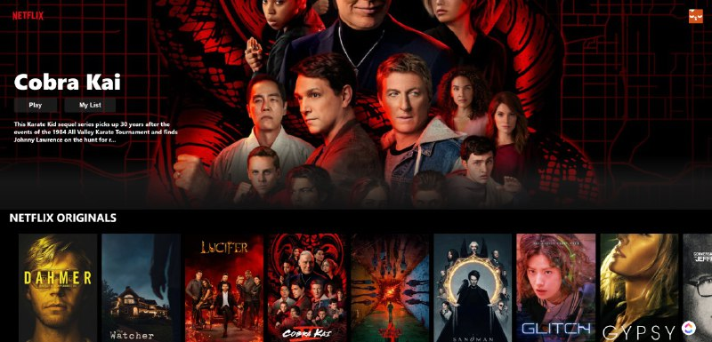

<a name="readme-top"></a>

<!-- PROJECT SHIELDS -->
<!--
*** I'm using markdown "reference style" links for readability.
*** Reference links are enclosed in brackets [ ] instead of parentheses ( ).
*** See the bottom of this document for the declaration of the reference variables
*** for contributors-url, forks-url, etc. This is an optional, concise syntax you may use.
*** https://www.markdownguide.org/basic-syntax/#reference-style-links
-->

[![LinkedIn][linkedin-shield]](https://www.linkedin.com/in/pranay4a/)

<!-- PROJECT LOGO -->
<br />
<div align="center">
  <a href="https://github.com/Pranay-a-1/Netflix-Clone-Firebase-Stripe-React">
    
  </a>

<h3 align="center">Netflix Clone</h3>

  <p align="center">
    Netflix Clone with Firebase integration for hosting, authorization and database and STRIPE for payments on customer subscriptions.
    <br />
    <a href="https://github.com/Pranay-a-1/Netflix-Clone-Firebase-Stripe-React"><strong>Explore the docs »</strong></a>
    <br />
    <br />
    <a href="https://netflix-clone-1cee1.firebaseapp.com/">View Demo</a>
    ·
    <a href="https://github.com/Pranay-a-1/Netflix-Clone-Firebase-Stripe-React/issues">Report Bug</a>
    ·
    <a href="https://github.com/Pranay-a-1/Netflix-Clone-Firebase-Stripe-React/issues">Request Feature</a>
  </p>
</div>

<!-- TABLE OF CONTENTS -->
<details>
  <summary>Table of Contents</summary>
  <ol>
    <li>
      <a href="#about-the-project">About The Project</a>
      <ul>
        <li><a href="#built-with">Built With</a></li>
      </ul>
    </li>
    <li>
      <a href="#getting-started">Getting Started</a>
      <ul>
        <li><a href="#prerequisites">Prerequisites</a></li>
        <li><a href="#installation">Installation</a></li>
      </ul>
    </li>
    <li><a href="#usage">Usage</a></li>
    <li><a href="#roadmap">Roadmap</a></li>
    <li><a href="#contact">Contact</a></li>
    
  </ol>
</details>

<!-- ABOUT THE PROJECT -->

## About The Project

<!-- [![Product Name Screen Shot][product-screenshot]]("./images/netflix-ss.jpeg") -->

<div align="center">
  <a href="https://github.com/Pranay-a-1/Netflix-Clone-Firebase-Stripe-React">
    
  </a>
</div>

<!-- Here's a blank template to get started: To avoid retyping too much info. Do a search and replace with your text editor for the following: `github_username`, `repo_name`, `twitter_handle`, `linkedin_username`, `email_client`, `email`, `project_title`, `project_description` -->

<p align="right">(<a href="#readme-top">back to top</a>)</p>

### Built With

<!-- - [![Next][next.js]][next-url] -->

- [![React][react.js]][react-url]
- 
- Stripe

<p align="right">(<a href="#readme-top">back to top</a>)</p>

## Demo Website URL

```
https://netflix-clone-1cee1.firebaseapp.com/
```

<!-- GETTING STARTED -->

## Getting Started

<!-- This is an example of how you may give instructions on setting up your project locally.
To get a local copy up and running follow these simple example steps. -->

### Prerequisites

<!-- This is an example of how to list things you need to use the software and how to install them. -->

- npm
  ```sh
  npm install npm@latest -g
  ```

### Installation

<!-- 1. Get a free API Key at [https://example.com](https://example.com) -->

1. Clone the repo
   ```sh
   git clone https://github.com/Pranay-a-1/Netflix-Clone-Firebase-Stripe-React
   ```
2. Install NPM packages
   ```sh
   npm install
   ```
3. Run the project
   ```sh
   npm start
   ```

<p align="right">(<a href="#readme-top">back to top</a>)</p>

<!-- USAGE EXAMPLES -->

## Usage

How to subscribe to a plan -

<div align="center">
  <a href="https://github.com/Pranay-a-1/Netflix-Clone-Firebase-Stripe-React">
    
  </a>
</div>

<p align="right">(<a href="#readme-top">back to top</a>)</p>

<!-- ROADMAP -->

## Roadmap

- [x] Sign In / Sign UP (Firebase)
- [x] Subscription Plans (Stripe)
- [x] HomePage(React)

<!-- See the [open issues](https://github.com/github_username/repo_name/issues) for a full list of proposed features (and known issues). -->

<p align="right">(<a href="#readme-top">back to top</a>)</p>

<!-- CONTACT -->

## Contact

Pranay A - pranay_a@outlook.com

Project Link: [https://github.com/Pranay-a-1/Netflix-Clone-Firebase-Stripe-React](https://github.com/Pranay-a-1/Netflix-Clone-Firebase-Stripe-React)

<p align="right">(<a href="#readme-top">back to top</a>)</p>

<!-- MARKDOWN LINKS & IMAGES -->
<!-- https://www.markdownguide.org/basic-syntax/#reference-style-links -->

[contributors-shield]: https://img.shields.io/github/contributors/github_username/repo_name.svg?style=for-the-badge
[contributors-url]: https://github.com/github_username/repo_name/graphs/contributors
[forks-shield]: https://img.shields.io/github/forks/github_username/repo_name.svg?style=for-the-badge
[forks-url]: https://github.com/github_username/repo_name/network/members
[stars-shield]: https://img.shields.io/github/stars/github_username/repo_name.svg?style=for-the-badge
[stars-url]: https://github.com/github_username/repo_name/stargazers
[issues-shield]: https://img.shields.io/github/issues/github_username/repo_name.svg?style=for-the-badge
[issues-url]: https://github.com/github_username/repo_name/issues
[license-shield]: https://img.shields.io/github/license/github_username/repo_name.svg?style=for-the-badge
[license-url]: https://github.com/github_username/repo_name/blob/master/LICENSE.txt
[linkedin-shield]: https://img.shields.io/badge/-LinkedIn-black.svg?style=for-the-badge&logo=linkedin&colorB=555
[linkedin-url]: https://linkedin.com/in/linkedin_username
[product-screenshot]: images/screenshot.png
[next.js]: https://img.shields.io/badge/next.js-000000?style=for-the-badge&logo=nextdotjs&logoColor=white
[next-url]: https://nextjs.org/
[react.js]: https://img.shields.io/badge/React-20232A?style=for-the-badge&logo=react&logoColor=61DAFB
[react-url]: https://reactjs.org/
[vue.js]: https://img.shields.io/badge/Vue.js-35495E?style=for-the-badge&logo=vuedotjs&logoColor=4FC08D
[vue-url]: https://vuejs.org/
[angular.io]: https://img.shields.io/badge/Angular-DD0031?style=for-the-badge&logo=angular&logoColor=white
[angular-url]: https://angular.io/
[svelte.dev]: https://img.shields.io/badge/Svelte-4A4A55?style=for-the-badge&logo=svelte&logoColor=FF3E00
[svelte-url]: https://svelte.dev/
[laravel.com]: https://img.shields.io/badge/Laravel-FF2D20?style=for-the-badge&logo=laravel&logoColor=white
[laravel-url]: https://laravel.com
[bootstrap.com]: https://img.shields.io/badge/Bootstrap-563D7C?style=for-the-badge&logo=bootstrap&logoColor=white
[bootstrap-url]: https://getbootstrap.com
[jquery.com]: https://img.shields.io/badge/jQuery-0769AD?style=for-the-badge&logo=jquery&logoColor=white
[jquery-url]: https://jquery.com
